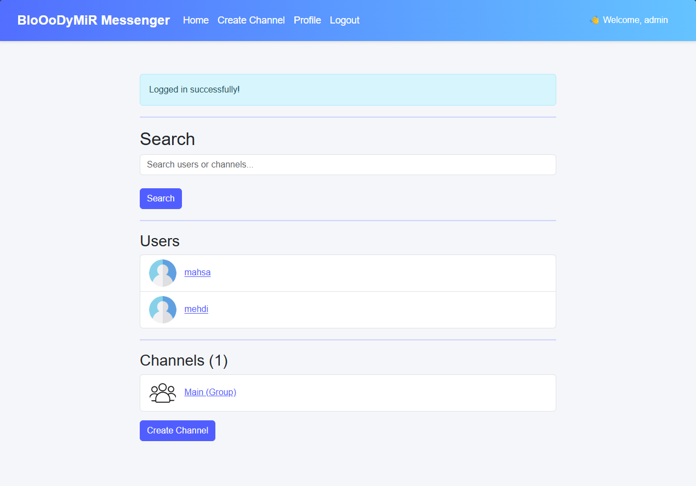
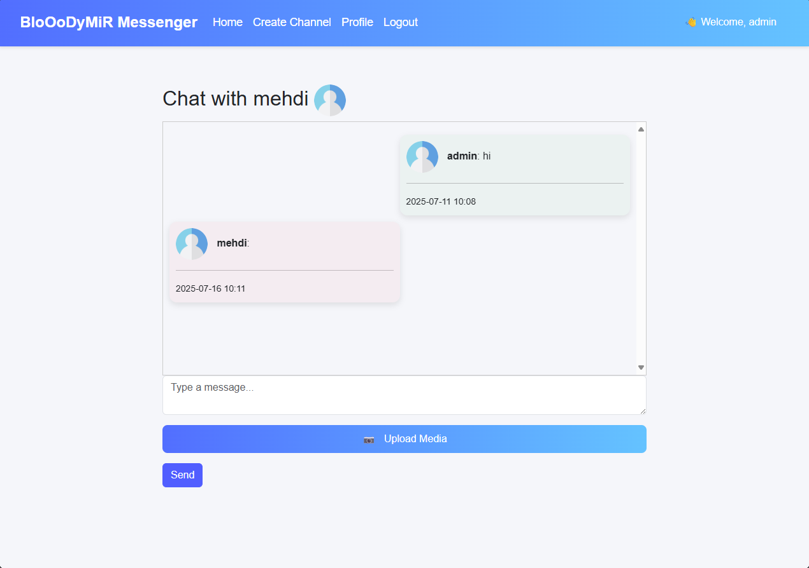
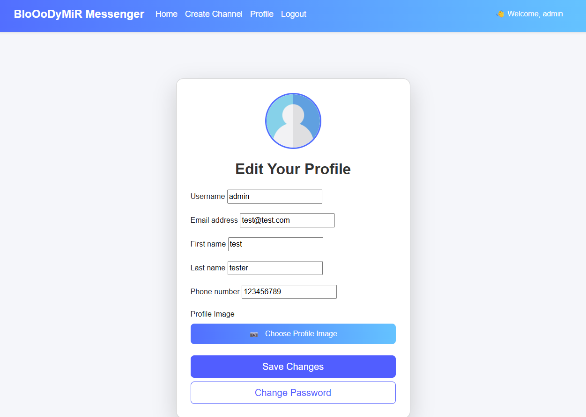

# 📨 Django Messenger App

A simple messaging app built with Django.

Created by **Mohammad Javad Taghavi** aka **BloOoDyMiR**

---

## 🧩 About the Project

This is a lightweight real-time messenger web app using Django framework. It allows users to:

- log in
- Search for other users
- Send and receive private messages or group chat

---

## 📸 Screenshots

### 🏠 Home Page

### 💬 Chat Page

### 🔐 Login Page

### 🧍 User Profile 

---

